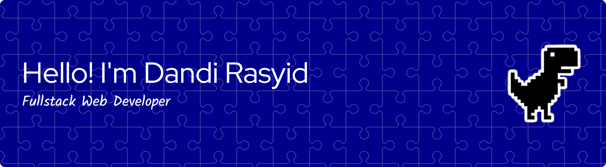

<!--
**dandirasyid/dandirasyid** is a ✨ _special_ ✨ repository because its `README.md` (this file) appears on your GitHub profile.

Here are some ideas to get you started:

- 🔭 I’m currently working on ...
- 🌱 I’m currently learning ...
- 👯 I’m looking to collaborate on ...
- 🤔 I’m looking for help with ...
- 💬 Ask me about ...
- 📫 How to reach me: ...
- 😄 Pronouns: ...
- ⚡ Fun fact: ...
- 🔭 I’m intern at **Telkom Property**
- 💻 I have experience with **Laravel, Filament, ReactJS, NextJS, ExpressJS, and REST API**
- 🎯 I’m interested in **Web Development, and Data Analyst**
-->

#### 🚀 About Me

I'm a passionate web developer with a strong interest in building modern and efficient web applications. I enjoy learning new technologies and continuously improving my skills in both frontend and backend development.

#### ⚡Skills

